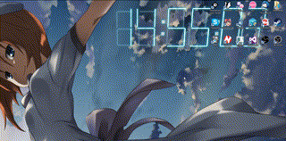

# Waifuized-Time-Lapsed-Digital-clock
A wallpaper for wallpaper engine

Took from workshop [Time lapse + 3D Digital Clock](http://steamcommunity.com/sharedfiles/filedetails/?id=835186492) and enhanced with centered on clock rotation effects and 竜宮 礼奈 as background

## How to install (for end users)

1. Go to http://steamcommunity.com/sharedfiles/filedetails/?id=837960115 and subscribe
2. The files of this wallpaper should be available at `{Your steam library path}\SteamApps\workshop\content\431960`

## How to install (for devs)

1. Go to wallpaper engine project folder

	```bash
	cd {Steam library path}\SteamApps\common\wallpaper_engine\projects\myprojects
	```
2. Clone this repo

	```bash
	git clone https://github.com/Uwy/Waifuized-Time-Lapsed-Digital-clock.git
	```
3. Start wallpaper engine and select this one and you're done, pretty much

## How to change the background

1. Put your picture in the `img` folder
2. Open ```css/component.css``` in your favorite code/text editor
3. Replace

	```css
	.demo-1 .large-header {
		background-image: url('../img/rena.png');
	}
	```
  By 

	```css
	.demo-1 .large-header {
		background-image: url('../img/{my picture name with extension }');
	}
	```
  Where `{my picture name with extension }` is the picture you just put in the `img` folder

  *Note : Get a list of what's supported as an image at [the MDN doc for this CSS attribute](https://developer.mozilla.org/en-US/docs/Web/CSS/background-image)*
4. Select another wallpaper in wallpaper engine and select this one back and voilà !
  
  
## How to change clock position

1. Open `index.html` in your favorite code/text editor
2. Replace

  ```html
  <div style="position:absolute;left: 850px; top:70px;"  class="time" id="time" data-hours="" data-minutes="">  <div class="digit">
  ```
  By
	
  ```html
  <div style="position:absolute;left: {x position}px; top: {y position}px;"  class="time" id="time" data-hours="" data-minutes="">  <div class="digit">
  ```
  Where `{x position}` is the x offset in pixels from the left side of your screen
  And `{y position}` is the y offset in pixels from the top of your screen

4. Select another wallpaper in wallpaper engine and select this one back and voilà !
